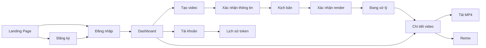

# UI – Thiết kế giao diện

## 1. Thông tin tài liệu

### 1.1. Thông tin chung

| Trường          | Nội dung |
| --------------- | -------- |
| Tên tài liệu    |          |
| Tên dự án       |          |
| Phiên bản       | 1.0      |
| Ngày cập nhật   |          |
| Người thực hiện |          |

### 1.2. Lịch sử thay đổi

| Phiên bản | Ngày       | Người cập nhật | Nội dung thay đổi |
| --------- | ---------- | -------------- | ----------------- |
| 1.0       | dd/mm/yyyy |                |                   |

---

## 2. Tổng quan thiết kế

### 2.1. Mục đích tài liệu

Mô tả thiết kế giao diện của hệ thống, bao gồm:

- Danh sách màn hình.
- Bố cục từng màn hình.
- Thành phần giao diện.
- Nội dung hiển thị.
- Hành vi tương tác.
- Trạng thái màn hình.
- Quy tắc kiểm tra dữ liệu.
- Điều hướng giữa các màn hình.
- Yêu cầu responsive.
- Tiêu chí nghiệm thu giao diện.

### 2.2. Phạm vi tài liệu

Nêu rõ các giao diện nằm trong phạm vi thiết kế, ví dụ:

- Giao diện người dùng.
- Giao diện quản trị.
- Giao diện máy tính.
- Giao diện responsive trên máy tính bảng và điện thoại.
- Không bao gồm thiết kế ứng dụng native nếu chưa triển khai.

## 3. Kiến trúc thông tin

### 3.1. Sơ đồ điều hướng

Ví dụ:

## 4. Danh sách màn hình

Tài liệu SRS hiện đã xác định các nhóm màn hình như đăng nhập, Dashboard, tạo video, theo dõi xử lý, chi tiết video, tài khoản, lịch sử giao dịch và màn hình quản trị.

| Mã màn hình | Tên màn hình | Route       | Vai trò | Mục đích            |
| ----------- | ------------ | ----------- | ------- | ------------------- |
| UI-001      | Landing Page | `/`         | Guest   | Giới thiệu sản phẩm |
| UI-002      | Đăng nhập    | `/login`    | Guest   | Xác thực người dùng |
| UI-003      | Đăng ký      | `/register` | Guest   | Tạo tài khoản       |

---

# 6. Đặc tả từng màn hình

Mỗi màn hình nên sử dụng chung một cấu trúc đặc tả.

## 6.x. `[Mã màn hình] – [Tên màn hình]`

### 6.x.1. Thông tin chung

| Trường           | Nội dung         |
| ---------------- | ---------------- |
| Mã màn hình      | UI-XXX           |
| Tên màn hình     |                  |
| Route            |                  |
| Vai trò truy cập | Guest/User/Admin |
| Link thiết kế    | Figma/Base44     |
| Phiên bản        |                  |

### 6.x.2. Mục đích

Mô tả ngắn gọn:

- Màn hình phục vụ nhu cầu gì?
- Người dùng cần hoàn thành tác vụ nào?
- Kết quả sau khi hoàn thành là gì?

### 6.x.3. Đối tượng sử dụng

- Vai trò nào được truy cập?
- Người dùng phải đăng nhập hay không?
- Có giới hạn quyền dữ liệu không?

### 6.x.4. Điều kiện truy cập

Ví dụ:

- Người dùng đã đăng nhập.
- Project thuộc người dùng hiện tại.
- Project đã có kịch bản.
- Project ở trạng thái cho phép chỉnh sửa.
- Người dùng có đủ token.

### 6.x.5. Bố cục màn hình

Mô tả theo các vùng:

1. Header.
2. Sidebar.
3. Breadcrumb.
4. Tiêu đề trang.
5. Khu vực nội dung chính.
6. Khu vực thao tác.
7. Footer hoặc thanh hành động cố định.

Có thể đính kèm:

- Wireframe.
- Screenshot.
- Link Figma.
- Hình đánh số từng thành phần.

### 6.x.6. Đặc tả trường dữ liệu

| Tên trường | Kiểu     | Độ dài | Bắt buộc | Giá trị mặc định | Quy tắc kiểm tra              |
| ---------- | -------- | -----: | -------- | ---------------- | ----------------------------- |
| Tên video  | Text     |    255 | Có       | Trống            | Không chỉ chứa khoảng trắng   |
| Ý tưởng    | Textarea |  5.000 | Có       | Trống            | Tối thiểu 20 ký tự            |
| Giọng đọc  | Select   |      — | Có       | Nữ               | Phải thuộc danh sách cấu hình |
| Thời lượng | Select   |      — | Có       | 30 giây          | Chỉ chọn giá trị được hỗ trợ  |

### 6.x.7. Quy tắc kiểm tra dữ liệu

| Mã      | Quy tắc                                        |
| ------- | ---------------------------------------------- |
| VAL-001 | Trường bắt buộc không được để trống            |
| VAL-002 | Không chấp nhận nội dung chỉ chứa khoảng trắng |
| VAL-003 | Không cho gửi form khi đang xử lý              |
| VAL-004 | Nội dung phải vượt qua kiểm duyệt              |
| VAL-005 | Hiển thị lỗi ngay dưới trường tương ứng        |

### 6.x.8. Điều hướng

| Thao tác             | Trang đích                 |
| -------------------- | -------------------------- |
| Đăng nhập thành công | `/dashboard`               |
| Bấm Tạo video        | `/create-video`            |
| Chọn project         | `/projects/:id`            |
| Xác nhận kịch bản    | `/projects/:id/processing` |
| Bấm Remix            | `/projects/:id/remix`      |

### 6.x.14. Phân quyền

| Vai trò |   Xem |  Thêm |              Sửa |   Xóa | Xác nhận |
| ------- | ----: | ----: | ---------------: | ----: | -------: |
| User    |    Có |    Có | Dữ liệu của mình | Không |       Có |
| Admin   |    Có |    Có |               Có |    Có |       Có |
| Guest   | Không | Không |            Không | Không |    Không |

### 6.x.17. Tiêu chí nghiệm thu UI

| Mã AC     | Tiêu chí                                                |
| --------- | ------------------------------------------------------- |
| AC-UI-001 | Màn hình hiển thị đúng bố cục đã được phê duyệt         |
| AC-UI-002 | Các trường bắt buộc có dấu hiệu nhận biết               |
| AC-UI-003 | Thông báo lỗi hiển thị đúng vị trí                      |
| AC-UI-004 | Nút chính chỉ hoạt động khi dữ liệu hợp lệ              |
| AC-UI-005 | Màn hình responsive trên desktop, tablet và mobile      |
| AC-UI-006 | Trạng thái loading, empty và error được hiển thị đầy đủ |
| AC-UI-007 | Người dùng không có quyền không thể truy cập màn hình   |

## 10. Yêu cầu kỹ thuật giao diện

### 10.1. Hiệu năng

- Thao tác giao diện thông thường phản hồi trong khoảng 3 giây.
- Có loading hoặc skeleton khi tải dữ liệu.
- Không khóa toàn bộ giao diện trong lúc render video.
- Tiến trình vẫn được lưu khi người dùng rời trang.

### 10.2. Bảo mật

- Không hiển thị API key trên frontend.
- Không hiển thị dữ liệu project của người khác.
- Link tải file sử dụng URL có thời hạn.
- Không lưu dữ liệu nhạy cảm vào trình duyệt ngoài phạm vi cần thiết.

### 10.3. Tương thích

- Chrome phiên bản hiện hành.
- Microsoft Edge phiên bản hiện hành.
- Safari nếu có người dùng macOS/iOS.
- Android Chrome.
- Responsive từ 360px trở lên.
